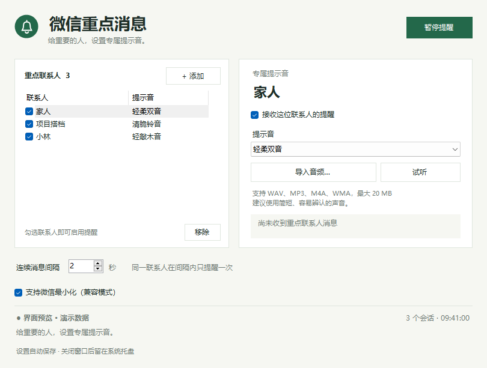

# 轻响 · WeChatChime

给重要的人，留一个特别的提示音。

轻响是一款 Windows 微信消息提醒小工具。选好重点联系人，为每个人设置熟悉的声音，微信最小化时也能留意他们的新消息。平时安静地待在系统托盘，需要调整时再打开。

**[下载最新版](https://github.com/kianbqh/WeChatChime/releases/latest)** · [更新记录](CHANGELOG.md) · [反馈问题](https://github.com/kianbqh/WeChatChime/issues)



*界面预览使用演示联系人。*

## 简单几件事，做得顺手

- **专属提示音**：为每位重点联系人单独设置声音，随时试听或暂停。
- **自己的声音**：内置 3 种短音，也支持导入 WAV、MP3、M4A、WMA。
- **最小化提醒**：开启兼容模式后，微信最小化时继续读取会话。
- **控制提醒频率**：连续消息间隔可设为 0–30 秒，默认 2 秒，避免一串消息连续响铃。
- **轻装运行**：原生 Windows 界面，主程序约 70 KB，解压即用，无需额外安装浏览器运行时。

当前版本：**v0.2.0**。适用于 **Windows 10 / 11 x64**，最小化兼容模式目前适配 **微信 4.1.13.63**。

## 开始使用

1. 从 [Releases](https://github.com/kianbqh/WeChatChime/releases/latest) 下载 Windows 压缩包，解压到一个可写文件夹，双击 `WeChatChime.exe`。
2. 登录电脑版微信，**置顶重点联系人的会话**。在轻响中勾选“支持微信最小化（兼容模式）”，等待底部显示正在监听。
3. 点击“+ 添加”，从近期会话选择联系人，也可以输入与微信一致的完整备注名。选择提示音，点击“试听”。
4. 保持微信最小化，等这位联系人发来一条新消息，确认提示音符合你的习惯。之后关闭轻响窗口，让它留在托盘即可。

单击托盘图标或再次打开程序，可以回到设置界面；右键托盘图标选择“退出”，完全关闭轻响。联系人设置和导入音效保存在程序旁的 `data` 文件夹，移动软件时一起带走即可。

## 使用提示

轻响根据**会话未读数的增加**触发声音。第一次连接时会记住已有未读，之后再提醒新变化。正在阅读的聊天、未读数封顶、会话不在可读取列表中等情况，可能不会触发提醒，所以建议将重点联系人置顶。多个联系人使用相同显示名时，请先为他们设置不同备注名。

导入音频的单文件上限为 20 MB，格式播放能力取决于 Windows 的解码器。选好后试听一次，确认能够正常播放。

微信升级可能影响兼容模式。遇到无法读取时，可以先查看窗口底部的状态说明；反馈问题时带上微信版本和状态文字，会更方便定位。

## 实现方式

轻响使用 **C#、Windows Forms 和 .NET Framework 4.x**，直接调用 Windows 的界面、托盘和音频能力。项目不依赖第三方运行库，重点是让一个常驻工具保持简单。


**会话读取与提醒判定。** 后台工作线程通过 UI Automation 读取微信会话列表，提取联系人名称和未读数。每轮读取后等待约 1.8 秒，读取暂不可用时延长到 5 秒重试。列表属性通过缓存请求一起获取，避免反复跨进程查询。提醒引擎将新快照与上一轮状态比较，再应用联系人开关和提醒间隔；首次连接只建立基线，短暂读取失败保留已有状态，同名会话则停止该名称的提醒，避免把不同联系人混在一起。

**最小化兼容。** 微信当前版本默认没有提供完整的辅助访问控件树。用户开启兼容模式后，程序校验微信版本、DLL 的 SHA-256 和运行时指令，再启用微信进程中的一个辅助访问状态字节，让会话控件在最小化时仍可读取。该状态在监听期间保持启用，关闭兼容模式或正常退出时还原由轻响做出的修改。这是一项针对特定微信版本的非官方适配，实现与验证记录见 [兼容性说明](docs/compatibility.md)。

**线程与资源。** 会话读取在独立 MTA 线程中完成，界面通过 UI 线程更新，音频使用按需创建的 STA 线程。内置短音由代码生成 PCM WAV，导入音频使用 Windows MCI 播放；播放请求合并处理，同一时间只播放一个声音。配置以 JSON 原子写入，导入音效使用相对路径保存，方便整个文件夹迁移。会话预览会随界面读取进入内存，程序仅提取识别所需信息，不保存聊天正文。

主要代码：

| 文件 | 职责 |
| --- | --- |
| [`src/Monitor.cs`](src/Monitor.cs) | UI Automation 读取、会话解析、未读变化判定与监听状态 |
| [`src/CompatibilityAccess.cs`](src/CompatibilityAccess.cs) | 微信版本适配、运行时状态校验与还原 |
| [`src/Core.cs`](src/Core.cs) | 联系人规则、本地配置、音效生成与播放 |
| [`src/MainForm.cs`](src/MainForm.cs) | 联系人和音效设置、托盘交互 |

## 构建与测试

在 Windows 10 / 11 x64 上，用 PowerShell 在项目目录运行：

```powershell
.\build.ps1
.\test.ps1
.\package.ps1
```

脚本使用系统 .NET Framework 4.x 自带的 C# 编译器，无需下载依赖。程序输出到 `release`，测试产物输出到 `artifacts`。`package.ps1` 在独立目录构建，并将便携 ZIP 和 SHA-256 校验文件输出到 `dist`，不影响正在运行的程序。

完整测试包含原生窗口交互，适合在 Windows 桌面运行。GitHub Actions 使用 `test.ps1 -SkipUi` 检查配置、音效、提醒规则与兼容校验，再构建下载包。实机验证范围见 [兼容性说明](docs/compatibility.md)。
